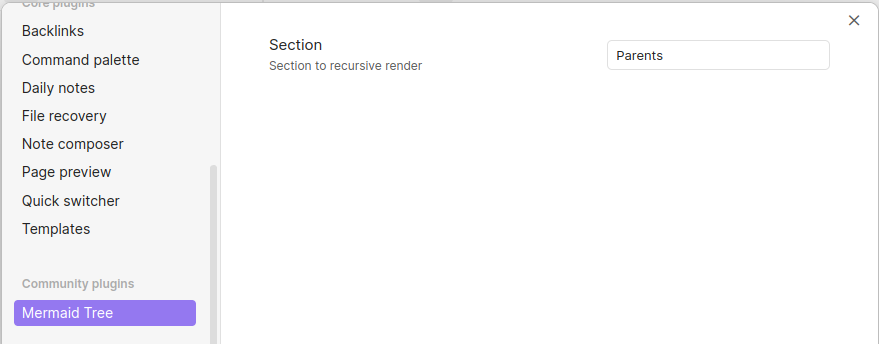
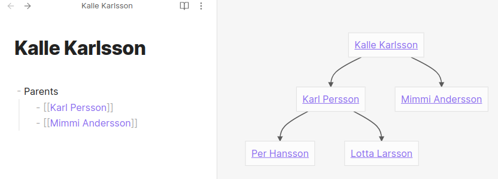

# Obsidian Mermaid Tree

With this plugin, you can preview all outgoing links for a section recursively. This can be used to show a family relation tree where the parents are linked notes within a section.

Then name of the section to render is managed as a setting.

## Usage

Under obsidian settings for Mermaid Tree, set the section to recursive render outgoing links from.

In this example, the section `Parents` are set to render as tree.

## Contributing

This plugin is a generated from the [obsidian-sample-plugin](https://github.com/obsidianmd/obsidian-sample-plugin)

Ideas and contribution regarding the Mermaid Tree plugin are welcome!

### How to develop

- Clone this repo.
- `npm i` or `yarn` to install dependencies
- `npm run dev` to start compilation in watch mode.

### Releasing new releases

- Update your `manifest.json` with your new version number, such as `1.0.1`, and the minimum Obsidian version required for your latest release.
- Update your `versions.json` file with `"new-plugin-version": "minimum-obsidian-version"` so older versions of Obsidian can download an older version of your plugin that's compatible.
- Create new GitHub release using your new version number as the "Tag version". Use the exact version number, don't include a prefix `v`. See here for an example: https://github.com/obsidianmd/obsidian-sample-plugin/releases
- Upload the files `manifest.json`, `main.js`, `styles.css` as binary attachments. Note: The manifest.json file must be in two places, first the root path of your repository and also in the release.
- Publish the release.

> You can simplify the version bump process by running `npm version patch`, `npm version minor` or `npm version major` after updating `minAppVersion` manually in `manifest.json`.
> The command will bump version in `manifest.json` and `package.json`, and add the entry for the new version to `versions.json`

### Manually installing the plugin

- Copy over `main.js`, `styles.css`, `manifest.json` to your vault `VaultFolder/.obsidian/plugins/obsidian-mermaid-tree/`.
